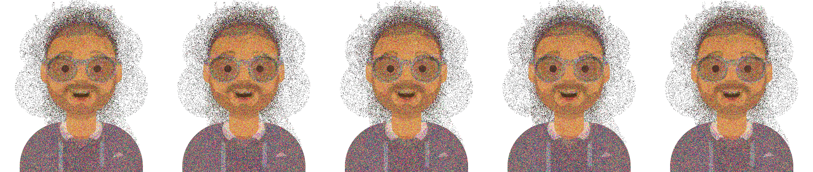
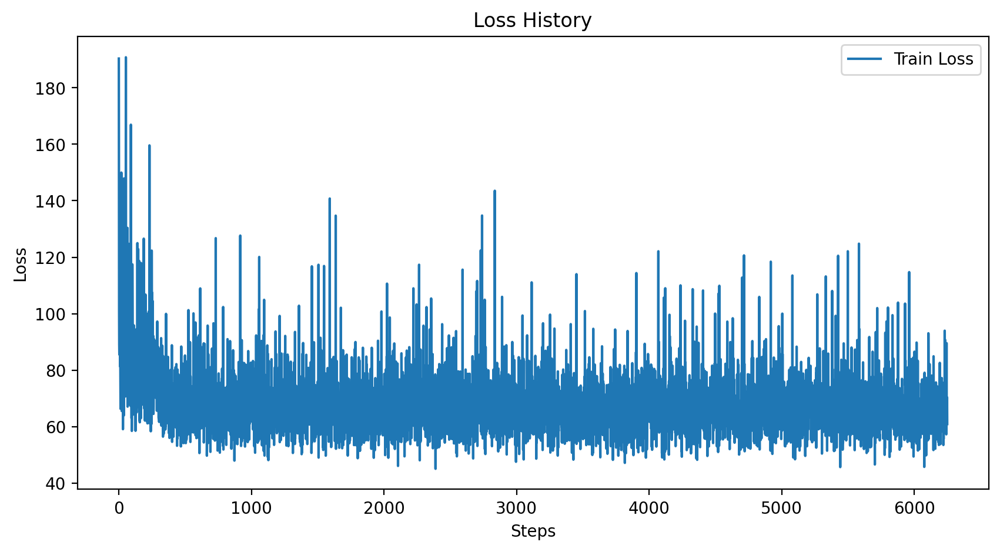
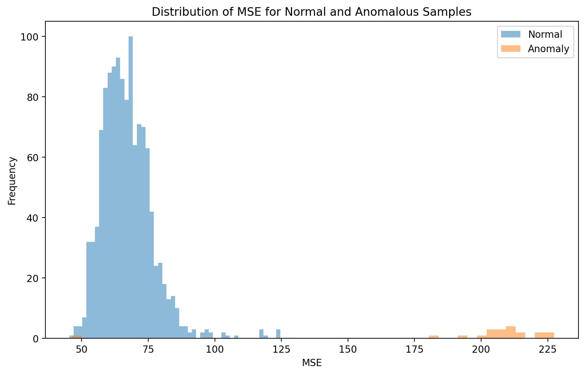
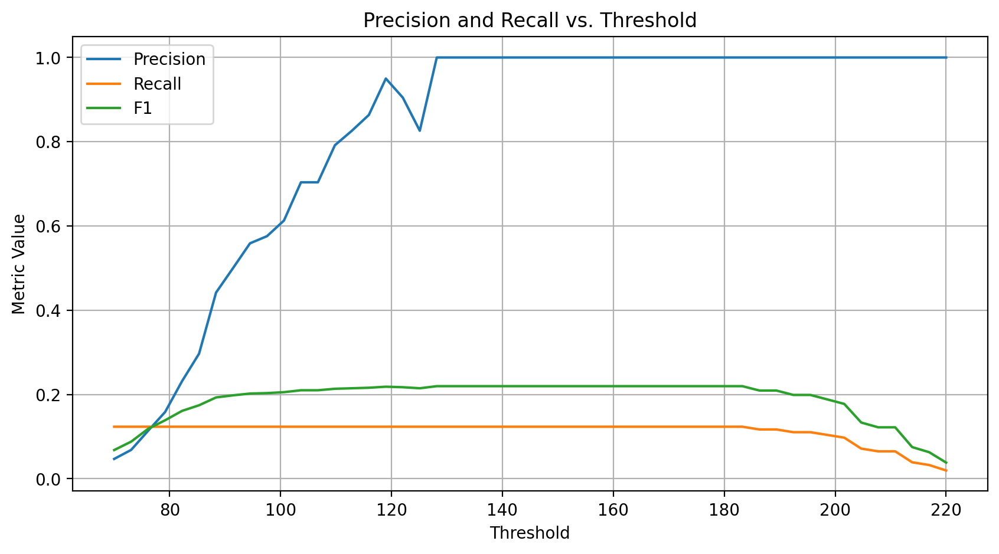

# HW1: байесовская генерация и детекция аномалий
Пухкало Владислава Анатольевна

Данные: для решения задачи используются приложенные к дз датасеты

## Результаты

1) Написан генератор для генерации стилей по формуле Байесовской вероятности
   
2) С помощью того же подхода при обучении на avatars написан генератор аватаров. Примеры генераций:

3) Имплементирован cверточный автоэнкодер, обучен на нормальных образцах

4) Проведен EDA и получено значение трешхолда MSE для детекции проливов

5) Написан метод классификации лунок

6) На изображениях из dataset\test протестировано качество и посчитаны метрики:
   FPR: 0.1, FNR: 0.76, F1:0.12, precision:0.08, recall:0.24
